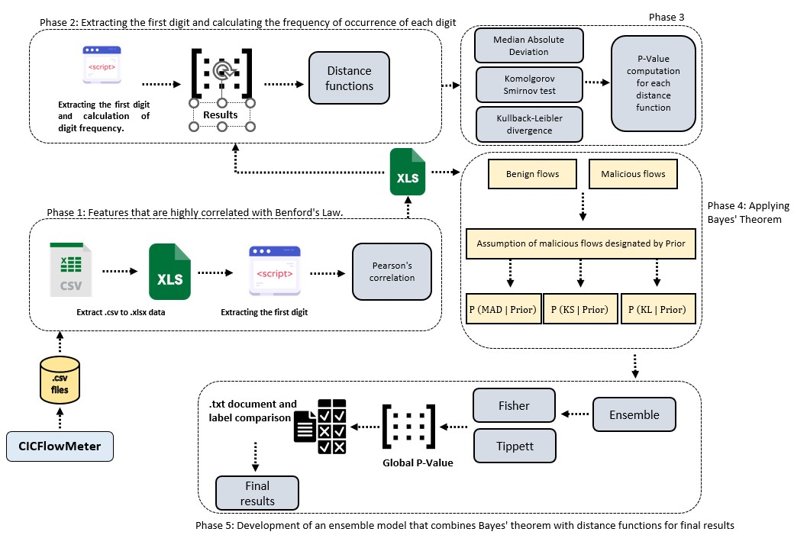
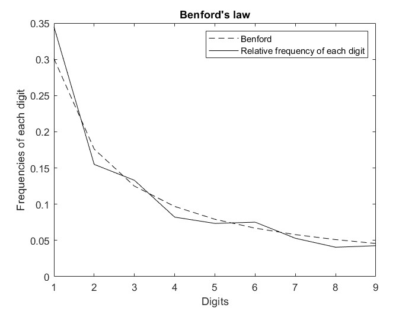

# Unvelling-Network-Malicious-flows

+ Pedro Fernandes - Department of Computer Engineering; Limerick Institute of Technology; Limerick, Ireland; Pedro.Fernandes@tus.ie ; Mathematics Department; Polytechnic Institute of Leiria; Leiria, Portugal; pedro.a.fernandes@ipleiria.pt

+ Séamus Ó Ciardhuáin - Department of Computer Engineering; Limerick Institute of Technology; Limerick, Ireland; seamus.ociardhuain@tus.ie

+ Mário Antunes - Computer Science and Communication Research Centre (CIIC), School of Technology and Management, Polytechnic of Leiria; Leiria; Portugal; mario.antunes@ipleiria.pt INESC TEC, CRACS; Porto; Portugal

# Benford's law-based method 

This paper introduces a novel method for identifying and analyzing anomalies within computer networks. It integrates Benford’s Law into the analysis process and incorporates a range of distance functions, namely the Mean Absolute Deviation (MAD), the Kolmogorov-Smirnov test (KS), and the Kullback-Leibler divergence (KL), which serve as dispersion measures for quantifying the extent of anomalies detected in network flows. 

Several scripts are presented, including a built-in Matlab script (Extract first digits, Tables MAD, KS, and KL Divergence). The procedure starts by extracting the first digits from a database containing malicious and benign flows. 
Subsequently, the obtained values are stored in a database format to .xls format. The first digit is extracted from this database, and the hypothesis tests (Pearson, Median Absolute Deviation, Kolmogorov-Smirnov test and Kullback-Leibler divergence) are applied. 

This procedure will allow the classifications. This entire classification procedure can be carried out by calculating the P-value obtained from the distance between the empirical frequency of occurrence of the digits from Benford's law and the relative frequencies of the digits extracted from the set of flows. 

# Dataset containing malicious and benign flows

This dataset was obtained from the UNB (University of New Brunswick) website and can be consulted (https://www.unb.ca/cic/datasets/ids-2017.html).

Important note: 
This dataset only contains network flows.
The final dataset is labelled correctly and consists of 19000 manipulated flows labelled 1 and 10000 benign flows labelled 0. 
If you wish to test the model with the dataset used, please send an e-mail to Pedro.Fernandes@tus.ie 

| Week date | Type of activity | Flows extracted | 
| ---- | ---- | ---- | 
| Monday| Only benign flows | 2000 | 
| Tuesday| Benign flows | 2000 |  
| Tuesday| Malicious flows | 4000 |  
| Wednesday| Benign flows | 2000 |  
| Wednesday| Malicious flows | 10000 |  
| Thursday| Benign flows | 2000 |
| Thursday | Malicious flows | 4000 |   
| Friday | Benign flows | 2000 |
| Friday| Malicious flows | 1000 |
| Total | 10000 | 19000 |

# General architecture 

The experiment was structured in different stages, and was based on the correlation of the features with the data:

First phase:
 + First Stage: features with a correlation of $70\%$ or more were intriguingly grouped into Cluster 1, which indicates a substantial correlation between the observed frequencies.
 + Second Stage: features with a correlation of $80\%$ or more were significantly grouped into Cluster 2, reflecting a strong correlation between the frequencies.
 + Third Stage: Finally, features with a $90\%$ or more correlation were grouped into Cluster 3, highlighting a robust correlation. Each stage was meticulously planned to ensure a rigorous and detailed analysis of data trends by Benford's Law.
+ Fourth Stage: A comparison was made between the number of features extracted by the method based on Pearson's correlation and other methods based on distance functions. The results show that the correlation technique more effectively selects the ideal features for identifying malicious flows.
Second phase:
+ An ensemble was developed from the p-values to maximise the detection of malicious flows, reducing the number of false positives and improving the evaluation of the model.

 

The figure shows the general architecture of the model, divided into three main blocks: pre-processing, processing and analysing the results. This model is based on Benford's Law, distance functions and Bayes' Theorem, with an ensemble to aggregate the p values obtained through Bayes' Theorem.

Preprocessing involved reducing the data and calculating the Pearson correlation using Microsoft Excel for each flow characteristic. A Matlab script was developed to extract the first digit of each network flow, storing this data in a matrix of digits.

Data processing was divided into two main stages: the first calculated the frequency of occurrence of each digit and stored the results in a frequency matrix. From this data, a Matlab script determined the frequency of each digit based on the characteristics identified in the pre-processing, allowing the distance between the observed frequencies of each digit and the frequencies predicted by Benford's Law to be calculated.

The second processing stage applied distance functions to compare these frequencies with the empirical frequencies predicted by Benford's Law, using the mean absolute deviation, the Kolmogorov-Smirnov test and the Kullback-Leibler divergence. The aim was to classify the data set and ensure network flow efficiency. The classification was carried out graphically and probabilistically, making it easier to visualise the discrepancies between the observed frequencies and those predicted by Benford's Law.

In addition to calculating the p-value of each distance function, statistical inference was used for the classification, using Bayes' Theorem. This method aggregated the distance functions to calculate the global p-value for each flow, making it possible to compare the results with different degrees of statistical significance through hypothesis tests. The p-value indicated the probability of obtaining a test statistic as extreme as the one observed, assuming that the null hypothesis is correct, and defined the significance level for rejecting the null hypothesis. If the p-value was less than the significance level set, there was strong statistical evidence to reject the null hypothesis, indicating that the network flow was malicious. The significance levels adopted - 0.1, 0.01 and 0.05 - followed the standards recognised in the literature.

 

# Some results

